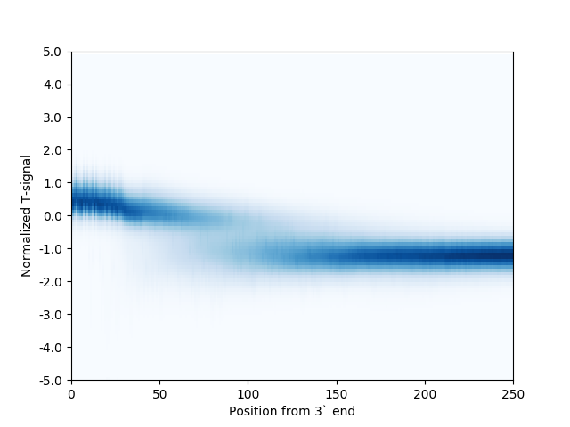
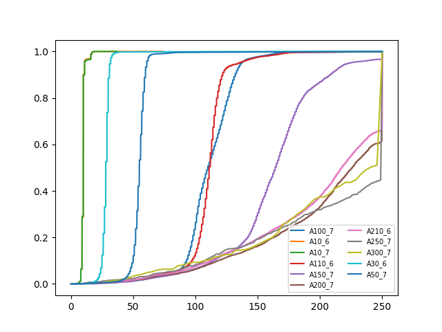

# Tail-Seq

This pipeline aligns reads from PAIL-Seq, find the 3' ends of transcripts, and estimates poly(A)-tail lengths.

Requirements:
- Python 3.4 or above
- STAR (optional)
- bedtools

We recommend making a Python3 virtual environment. After cloning this repository, navigate to the directory and install the python dependencies:
```
pip install -r requirements.txt
```

Input files:
- genomeDir: directory of STAR index (optional if you use a different aligner)
- fastq1: fastq file from read1, gzipped
- fastq2: fastq file from read2, gzipped
- gff: gene annotations in gff format
- intensity: raw intensity values for read2, gzipped
- standard_file: tab-delimited file where the first column is the standard sequence and the second column is the name of the standard (optional, example in examples/standard_sequences.txt)
- outdir: directory for output files

1. Check run configurations in tail-seq-scripts/config.py. Check STAR parameters in Makefile.
2. Make an output directory.
3. Navigate to the tail-seq directory and run all scripts at once:
```
make genomeDir=<genomeDir> fastq1=<fastq1> fastq2=<fastq2> gff=<gff> intensity=<intensity> standard_file=<standard_file> outdir=<outdir> all
```

To run after genome alignment step, make sure there is a sorted BAM file named STAR_Aligned.sortedByCoord.out.bam in your output directory. Then run:
```
make fastq1=<fastq1> fastq2=<fastq2> gff=<gff> intensity=<intensity> standard_file=<standard_file> outdir=<outdir> all_from_bam
```

-- OR --

3. Align to genome. To use STAR with our parameters, navigate to the tail-seq directory and run:
```
make genomeDir=<path to STAR index> fastq1=<path to fastq1> outdir=<path to output directory> align-to-genome
```
4. Intersect with the annotation file. If you used your own aligner, make sure there is a sorted BAM file named STAR_Aligned.sortedByCoord.out.bam in your output directory.
```
make gff=<path to gff file> outdir=<path to output directory> intersect-gff
```
5. Preprocess data and calculate normalized T-signal intensities. Separates standards if standard file is given. Outputs:
- dropped_reads.txt: Reads that were dropped and the reason for dropping. This does not include reads that were dropped because they do not map.
- all_read_info.txt: 3' end and accession information for reads that were kept. For reads that come from standards, the chromosome is set to "standard", the chromosome location is set to 0, and the strand is set to "+".
- short_tails.txt: Reads with tails less than 10 nucleotides in length are called manually. These will be added to the rest of the tail lengths later.
- normalize_t_signal.txt: normalized T-signal for reads that will be called with an HMM.
- logfile.txt: Information about how long each step takes and how many reads are dropped at each step.
```
python tail-seq-scripts/get_signal_from_raw.py --f1 <fastq1> --f2 <fastq2> -i <intensity> -s <standard_file> -o <outdir>
```
6. Train HMM and call tail lengths. Outputs:
- tail_lengths.txt: Tail length, 3' end location, and tail-calling method (HMM or manual for short tails) for every read. For reads that come from standards, the chromosome is set to "standard", the chromosome location is set to 0, and the strand is set to "+".
```
python tail-seq-scripts/tail_length_hmm.py -o <outdir>
```
7. Calculate and plot summaries. plot_t_signals.py plots a heatmap of normalized T-signal densities. 
```
python tail-seq-scripts/plot_t_signals.py -o <outdir>
```
Here is an example:



summarize_results.py computes mean and median tails lengths for each accession and plots CDFs of standards (if a standard file was given earlier)

```
python tail-seq-scripts/summarize_results.py -o <outdir>
```

Here is an example:


